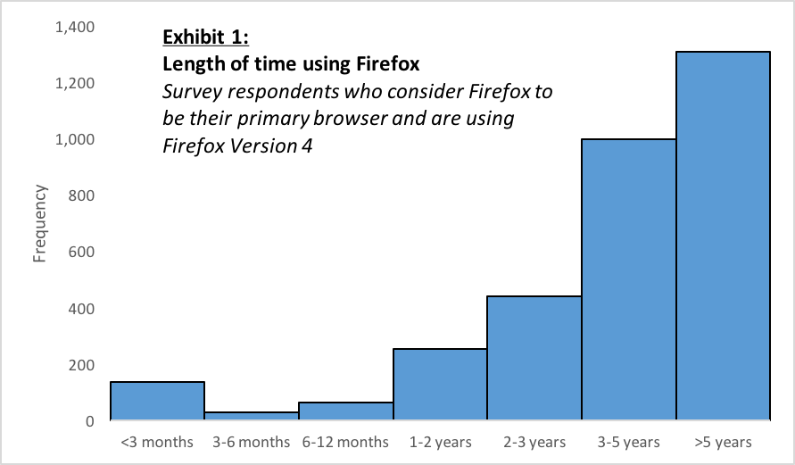
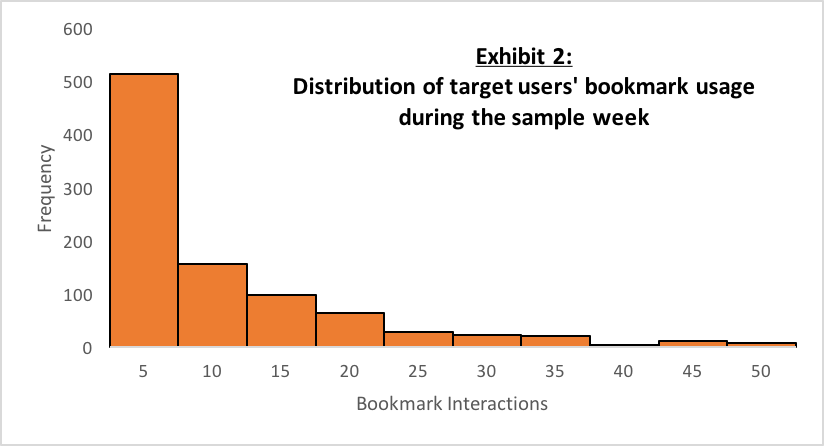
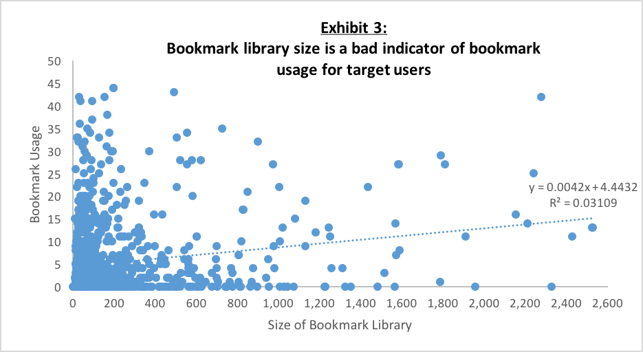
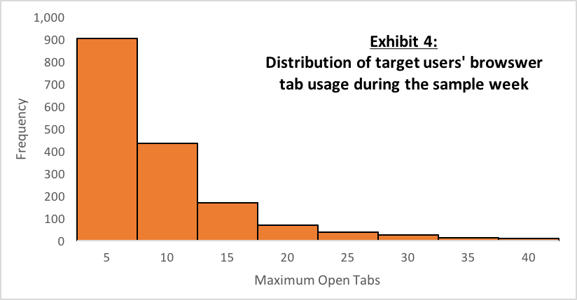
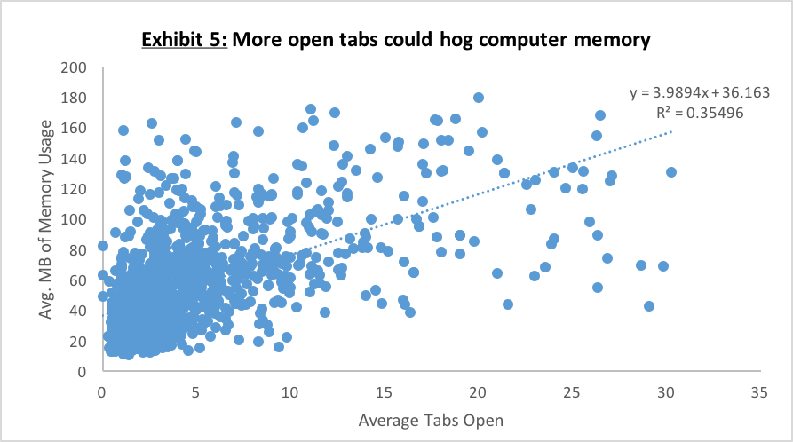

## Firefox User Analysis
Created by **Stuart King**, May 2016

This repository is a collection of files used to analyze Mozilla Firefox user activity in accordance with the provided prompt. Results of my analysis are described below.

### Prompt

It's 2010 and you are a junior product manager working for Mozilla Firefox. You are chatting with an opinionated colleague of yours, and you ask her thoughts about your idea to revamp the bookmarks experience. She says that bookmarks aren't interesting and you should help her in her quest to improve support for having a large number of tabs instead. Your boss has asked you to put together a presentation recommending an area of focus for the next version of Firefox. Considering the analytics workflow, you decide to look at a recent week-long test flight with customer surveys and usage analytics to better inform your thinking before deciding which of the two areas to recommend. Mozilla is running its own PostgreSQL server, and the engineers that designed the survey have added that data to three database tables: **events**, **survey**, and **users**. Connect to the server using the software of your choice, navigate to the database, and use the data to help make your decision.

### Introduction
This memorandum serves to summarize the research, findings, and recommendations related to the user interactions with bookmarks and browser tabs of the company’s core product, Mozilla Firefox. **Based on an analysis of user information, survey results, and product usage, I recommend that our department focus product development and user support on browser tab features and functionality, while simultaneously working to decrease the amount of memory required to maintain multiple open tabs.**

### Data and Methodology
Data utilized includes customer surveys and usage analytics gathered by Mozilla’s software engineers. The data is stored on Mozilla’s PostgreSQL server and organized in three separate tables: events, survey, and user. To arrive at actionable findings, my research was divided into 1) user and survey information, 2) usage of the bookmark features, and 3) usage of browser tabs. A user identification (ID) number was used as a unique identifier to link data across tables, allowing me to connect user information with survey responses and browser usage, defined as recorded events during an active session using the software (e.g. opening the browser, selecting a bookmark, memory usage, open tabs, etc.). A series of questions was defined to open exploration of the data, answers to which led to deeper analysis and summary findings and analysis.  

### User and Survey Information
To begin the research, I first explored the user data, specifically the users who completed the survey. Of the total number of Firefox users stored in the database, 4,081 users (15.0%) responded to some or all questions posed in the user survey. Regarding length of time using Firefox, 90.7% of survey respondents have used Firefox for one or more years, with only 5.3% of respondents having less than 90 days of experience using Firefox. 82.4% of respondents indicated that they consider Firefox to be their primary browser. Combining multiple variables, I found that 76.4% of respondents have one or more years of experience using Firefox and consider Firefox to be their primary browser. Analyzing the data one step further, it was discovered that 2,997 (73.4%) of respondents are a) long-term users (as defined by one or more years of experience using Firefox), b) consider Firefox to be their primary browser, and c) are using Firefox version 4. Understanding that this distinct sub-group of users represents the majority of the survey respondents, have extensive experience using Firefox, use Firefox as their primary Internet browsing platform, and are using the most current version of the software, I designated these users as my target population for further analysis of usage data. Below, Exhibit 1 presents a graphical representation of the distribution of users’ time using Firefox. The distribution clearly shows that the majority of survey respondents have extensive experience using Firefox. Regarding user age, 77% of target users are less than 35 years old.

<!--  -->

### Bookmarks Usage
To gain a better understanding of bookmark usage and habits of the sample population, I first compared the average number of bookmarks for each user in the data with the size of the bookmark libraries for my identified target users. For target users, the average bookmark library size is 255 bookmarks, which is significantly above an average library size for all users of 107 bookmarks. These results are not entirely surprising, however, as users who use Firefox as their primary browser and have one or more years of experience using Firefox should on average have larger bookmark libraries, if for no other reason than having more opportunity (time) to create additional bookmarks. A more telling statistic of bookmark usage is the fraction of target users who launched at least one bookmark during the sample week. During the defined time period, the proportion of target users who clicked on a bookmark was only 30.1%. To calculate the average number of bookmark interactions (select, create, delete, or modify), I calculated the total number of bookmark actions taken by target users and then divided by all target users to arrive at an average of 3.2 per target user. This result corresponds closely with the distribution of the number of bookmark interactions per target user, as visually depicted in Exhibit 2. To determine the distribution of target users’ bookmark usage during the sample week I removed outlier data as defined by summations of total bookmark usage for users that were more than three standard deviations from the mean.

Understanding that target users on average have large bookmark libraries, I sought to determine the correlation between the size of a target users’ bookmark library, and the number of recorded bookmark interactions per user. To do this I performed a linear regression analysis using the size of a user’s bookmark library as the independent variable (x-axis), and user bookmark usage as the dependent variable (y-axis). My hypothesis was that the larger a user’s bookmark library, the more often the user would interact with bookmarks. Before performing the regression, I removed values in both variables more than three standard deviations from their respective means. After this I used a scatter chart to plot all data points against the x- and y-axes. As visually apparent in Exhibit 3, a correlation coefficient of 0.1763 implies a positive linear relationship between the two variables, however, an r-squared value of 0.0311 suggests that very little of the variation within users’ bookmark usage can be explained by the size of the users’ bookmark libraries.

### Browser Tab Usage
By design, browser tab usage data is recorded on a rolling basis during a user’s active session on Firefox. Because data is collected multiple times for each user, to determine a representative distribution of tab usage for the target population I narrowed my analysis to the maximum value of tab usage recorded for each target user. Exhibit 4 is a graphical representation of the distribution of this data, from which data points more than three standard deviations from the mean (7.96 tabs) have been removed. As visually confirmed, the distribution is skewed to the right, with the majority of observations below 10 open tabs for each target user, but with some users having as many as 40 tabs open at any given time. It was observed that 36.7% of target users had over 5 tabs open at one point during their Internet browsing, 18.1% of target users had at one point over 10 tabs open, and 10.8% of target users had over 15 browser tabs open during the sample week. When considering average tab usage it was found that 180 target users (6%) had over 10 tabs open on average throughout their browsing session(s).

While descriptive results of browser tab usage indicate popularity, I wanted to better understand how tab usage correlates to the amount of processing memory required to maintain multiple open tabs. To do this I first compiled and cleaned the amount of memory usage for each target user. Because the amount of memory is recorded multiple times for each user throughout a browsing session, I took the average memory usage for each target user and then converted the raw data into a more common unit of measurement: megabytes (MB). In a similar manner, I calculated an average number of tabs open for each target user, due to the fact that multiple observations are recorded for each user. As with other data used in this analysis, I then removed all data points more than three standard deviations from variables’ respective means. Using the two cleaned variables, I then performed a linear regression by plotting the two variables on a scatter chart (Exhibit 5). The fitted line visually confirms a positive correlation (r=0.596), suggesting that as the number of tabs opened increases, the amount of processing memory used also increases. The slope of the fitted line tells us that for each new open tab, approximately 4 MB of processing memory is required. The coefficient of determination (r-squared) is 0.355, suggesting that a third of the variation within memory usage data can be explained or attributed to the number of tabs a user has open. For the purposes of this analysis, the observed r-squared value is considered to be statistically significant and indicative of a good fit of the variables used in the model. However, the regression does not explain all the variation within the data, and further analysis of other explanatory variables would be needed to draw stronger conclusions. For example, the model does not take into consideration what other computer programs the user is running at the time memory usage is recorded.

### Recommendations and Next Steps
As a result of my analysis, I have two key findings and recommendations.
1.	By reviewing the descriptive statistics and distributions of bookmark and tab usage for target users, it is clear that browser tabs are more commonly used. While the target users on average have large bookmark libraries, only 30.1% of target users were observed to have used bookmarks as a navigation feature during the sample week. Instead, the data suggests users on average employ multiple tabs throughout their browsing sessions. Based on these findings it is recommended to focus product development and user support on the browser tab feature of Firefox. I would caveat this recommendation by adding that in many ways bookmarks and tabs offer users different browsing utilities and are not mutually exclusive. Improving co-functionality of the two features is advisable.
2.	Based on the results of my linear regression model of browser tab usage and memory consumption, a statistical relationship exists between the number of opened tabs and the amount of memory usage recorded. Therefore, users that prefer to maintain a large amount of open tabs may experience poor browsing performance if the amount of memory usage reaches a certain threshold. Estimating the threshold of memory usage connected with deteriorating Firefox performance extends beyond the scope of this analysis, however, focusing department resources on reducing the amount of memory monopolized by opened tabs will allow Firefox to devote precious memory to other browsing features and improve the overall user experience.

### Limitations
By choosing to limit my analysis to a group of target Firefox users, my findings are descriptive of only this sub-set of the total population. Understanding user preferences and habits of casual or new Firefox users cannot be reasonably inferred by the results of this analysis. Furthermore, and specific to browser tab usage, tab usage aggregations are recorded as snapshots in time. As such, the data does not allow us to clearly differentiate between distinct tab actions taken by the user and tab automations from hyperlinks and pop-up windows. Finally, to gain an even richer understanding of user habits and preferences in regards to bookmark and browser tab usage, it would be good to analyze usage data over an extended time horizon. The findings are indicative of user behavior at one moment in time, but do not provide insight into trends over longer time periods.

### Notes on Analysis Replication
The vast majority of the aggregations and fractions cited in this memorandum were calculated directly in SQL. To create histograms of user experience with Firebox, bookmark usage, and browser tab usage of the target group (Exhibits 1, 2 and 4, respectfully) I started by writing SQL queries to segment the data stored in the PostgreSQL server into results grouped by user ID. The results from SQL were then exported to Microsoft Excel. In Excel I removed outliers of more than three standard deviations from the mean and grouped the data into bins using a frequency formula. A distribution bar chart was then created using the aggregated data.

For each linear regression discussed above I wrote two separate SQL queries to generate the two variables I wanted to correlate. The results of the queries were exported to Excel and I used the index/match function combination to pair the variables using the user ID as the matching identifier. Once the variables were combined I calculated descriptive statistics to better understand what I was working with. As with the distributions, I also removed outlier values from each variable that were more than three standard deviations from the mean. Once the data was clean I used Excel formulas to calculate the y-intercept, slope, Pearson coefficient, and r-squared values. To create the linear models I plotted the two variables on a scatter chart and used the Excel options to fit a line to the data and show the line equation on the chart.
